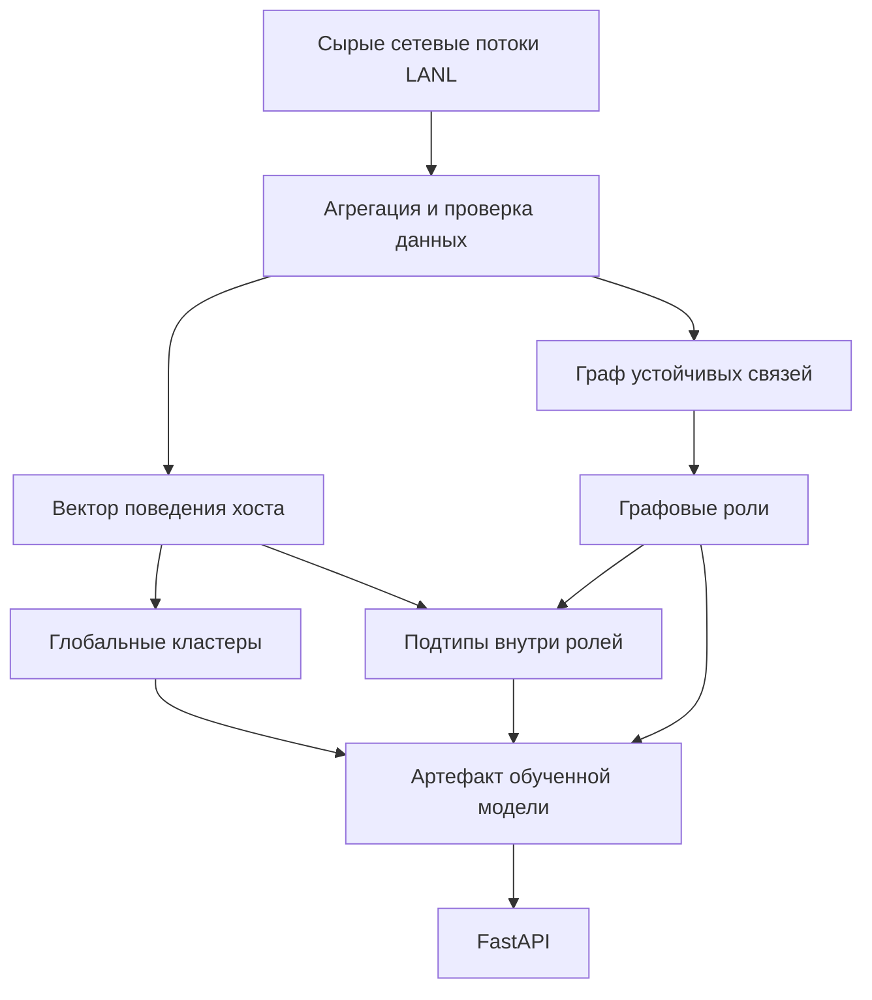

# Поиск похожих компьютеров по сетевому трафику LANL

Проект решает задачу из области Network Traffic Analysis: по истории сетевых
соединений компьютера находит похожие узлы корпоративной сети, относит хост к
поведенческой группе и объясняет, какие свойства трафика сделали два узла
похожими или различными.

В качестве данных используются сетевые потоки из открытого набора Los Alamos
National Laboratory. Сетевой поток — это агрегированная запись об обмене между
двумя компьютерами: время, длительность, отправитель, получатель, порты,
протокол, количество пакетов и байт.

Проект рассчитан на два сценария:

1. **Известный хост** уже участвовал в обучении. Для него сервис возвращает
   кластер, положение в графе сети, поведенческий подтип и ближайших соседей.
2. **Новый хост** отсутствует в обучающей выборке. Сервис принимает его полную
   историю сетевых потоков за 15 суток, назначает глобальный кластер поведения
   и находит похожие известные узлы.

Подробное описание гипотез, экспериментов и формул находится в
[исследовательской заметке](./docs/research-notes.md).

## Состояние требований тестового задания

Ниже не смешиваются реализованные функции и планы. DuckDB используется как
технический кэш обучения, но это **не** реализация SQL-хранилища запросов
пользователей.

| Требование | Статус | Где реализовано | Как проверить |
|---|---|---|---|
| Кластеризация компьютеров | Выполнено | `features.py`, `model.py`, `training.py` | Обучить модель и открыть `artifacts/similarity_model.json` |
| Поиск хостов, не попавших в плотные группы | Выполнено | HDBSCAN возвращает метку `-1` | `GET /hosts/{host_id}`, поле `is_noise` |
| Проверка устойчивости групп во времени | Выполнено экспериментально | Результаты приведены в исследовательской заметке | Раздел «Проверка устойчивости во времени» |
| Анализ клиентских и серверных паттернов | Частично | Есть направление трафика, взаимность связей и сетевые центральности | Содержательные названия ролей не присвоены без внешней разметки |
| Поиск похожих известных хостов | Выполнено | `service.py` | `GET /hosts/{host_id}/similar` |
| Объяснение найденного сходства | Выполнено | `service.py` | Поле `contributions` в ответе |
| Определение кластера нового хоста | Выполнено | `inference.py`, `POST /hosts/predict` | Отправить историю flows по примеру ниже |
| FastAPI | Выполнено | `api.py`, `schemas.py` | Открыть `http://127.0.0.1:8000/docs` |
| Docker и Docker Compose | Выполнено | `Dockerfile`, `docker-compose.yml` | `docker compose up --build api` |
| Структурированный код с классами | Выполнено | Пакет `src/nad_similarity` | См. карту модулей ниже |
| Разработка в Git | Зависит от репозитория сдачи | Локальная история Git не входит в код | Проверить вкладку Commits на GitHub |
| SQL-база сервиса и запись запросов | Не выполнено | DuckDB хранит только агрегаты обучения | В API нет слоя хранения запросов |
| Веб-интерфейс кластеризации | Не выполнено | Есть только Swagger UI от FastAPI | `/docs` документирует API, но не заменяет аналитический UI |
| Дополнительные функции | Выполнено | Графовые роли, локальные подтипы, сравнение пары хостов | `GET /hosts/compare` |

Тестовое задание прямо допускает неполную реализацию. Поэтому приоритет был
отдан воспроизводимой обработке данных, поиску похожих узлов, объяснению
результата и рабочему API. SQL-хранилище и отдельный веб-интерфейс не скрыты за
заготовками и честно отмечены как невыполненные.

## Что получилось в итоговой модели

В обучение вошли 4 350 хостов и первые 15 суток сетевых потоков.

| Результат | Значение | Как читать |
|---|---:|---|
| Глобальные поведенческие кластеры | 5 | Группы по времени, сервисам, размерам потоков, направлению и профилю соседей |
| Хосты вне глобальных кластеров | 1 019 из 4 350, 23,43% | HDBSCAN не нашёл для них достаточно плотной группы |
| Графовые роли | 8 | Группы по положению узла в устойчивом графе связей |
| Хосты вне графовых ролей | 945 из 4 350, 21,72% | Для этих узлов не найдена плотная структурная роль |
| Размер вектора глобальной модели | 454 признака | Числовое представление поведения одного хоста |
| Размер поведенческого вектора для локального поиска | 372 признака | То же представление без графового семейства |

Качество нельзя описать одним высоким числом. Коэффициент силуэта глобальных
кластеров равен `0.244`: разделение есть, но оно умеренное, а не идеальное.
Внутренняя относительная оценка HDBSCAN равна `0.0426`, что также требует
осторожной интерпретации. Графовые роли разделяются лучше: силуэт `0.370`,
внутренняя относительная оценка `0.4478`.


Рисунок нужен только для визуального контроля. Алгоритм не обучается на этих
двух координатах: кластеризация и поиск выполняются в исходном многомерном
пространстве.

## Основные понятия

| Термин | Значение в проекте |
|---|---|
| Хост | Компьютер сети, например `C1000` |
| Сетевой поток, `flow` | Одна агрегированная запись сетевого взаимодействия |
| Признак | Измеримая характеристика поведения, например доля исходящих потоков |
| Вектор признаков | Упорядоченный набор чисел, описывающий один хост |
| Кластер | Плотная группа похожих объектов, найденная без заранее известных классов |
| Шум, метка `-1` | Объект, для которого HDBSCAN не нашёл надёжной плотной группы |
| Граф сети | Узлы-компьютеры и рёбра-связи между ними |
| Устойчивая связь | Связь, наблюдавшаяся как минимум в 3 разных днях |
| Графовая роль | Кластер по структурному положению компьютера в сети |
| Поведенческий подтип | Дополнительное деление хостов внутри одной графовой роли |
| Ближайшие соседи | Известные хосты с минимальным расстоянием до запроса |
| HDBSCAN | Алгоритм плотностной кластеризации, умеющий оставлять выбросы без кластера |

Строка версии модели вроде `v2_v20_hierarchical` — это внутренний идентификатор
совместимости артефакта. Пользователю API не нужно знать смысл отдельных
экспериментальных номеров. Их история объяснена в приложении к
[исследовательской заметке](./docs/research-notes.md#приложение-внутренние-номера-экспериментов).

## Архитектура решения



Обучение и HTTP-сервис разделены. Обучение один раз создаёт артефакт
`artifacts/similarity_model.pkl`. При запуске API этот файл загружается в
память и используется только для чтения.

### Известный хост

Для известного хоста используется двухэтапный поиск:

1. сервис выбирает кандидатов с той же графовой ролью;
2. внутри этой роли кандидаты сортируются по поведенческому расстоянию.

Графовая и поведенческая дистанции не складываются с произвольным весом. Граф
определяет контекст поиска, а поведение — порядок ближайших соседей.

### Новый хост

Для нового хоста доступна только его собственная история сетевых потоков, но не
полный новый снимок корпоративной сети. Поэтому сервис:

1. строит те же агрегаты, что использовались при обучении;
2. применяет сохранённые категории и преобразования;
3. назначает глобальный поведенческий кластер;
4. ищет соседей во всём 454-мерном пространстве.

Графовая роль нового хоста возвращается как `null`. Это не пропуск реализации,
а ограничение входных данных: PageRank, число соседей второго порядка,
коэффициент кластеризации и номер ядра требуют полного графа сети.

## Карта исходного кода

| Путь | Назначение |
|---|---|
| `src/nad_similarity/aggregation.py` | Чтение gzip через DuckDB, валидация и построение компактных таблиц |
| `src/nad_similarity/features.py` | Преобразование агрегатов в числовые признаки |
| `src/nad_similarity/graph.py` | Отбор устойчивых связей и расчёт 7 графовых характеристик |
| `src/nad_similarity/model.py` | Глобальная HDBSCAN-модель и поиск ближайших соседей |
| `src/nad_similarity/hierarchy.py` | Поведенческие подтипы внутри графовых ролей |
| `src/nad_similarity/inference.py` | Агрегация истории ранее неизвестного хоста |
| `src/nad_similarity/service.py` | Прикладная логика ответов и объяснение расстояний |
| `src/nad_similarity/schemas.py` | Проверка структуры запросов и ответов через Pydantic |
| `src/nad_similarity/api.py` | HTTP-маршруты FastAPI и документация OpenAPI |
| `src/nad_similarity/artifacts.py` | Версионированное сохранение и загрузка модели |
| `src/nad_similarity/training.py` | Сценарий обучения и сверка с контрольными результатами |
| `tests/` | Модульные и HTTP-тесты |
| `docs/research-notes.md` | Исследовательская часть, гипотезы и метрики |

## Почему выбраны эти технологии

| Технология | Зачем используется |
|---|---|
| DuckDB | Читает большой сжатый файл и агрегирует данные без полной загрузки в оперативную память |
| pandas и NumPy | Табличные преобразования и численные операции после агрегации |
| scikit-learn | Нормирование, точный поиск соседей и расчёт метрик |
| HDBSCAN | Находит число групп из данных и явно выделяет объекты вне плотных групп |
| NetworkX | Рассчитывает структурные характеристики графа сети |
| FastAPI и Pydantic | HTTP API, строгая проверка входа и автоматическая документация |
| Docker Compose | Одинаковый запуск обучения и сервиса в изолированном окружении |

## Как строится числовое представление хоста

| Семейство | Размерность | Что описывает |
|---|---:|---|
| Время | 156 | Распределение flows, байт и пакетов по часу суток, абсолютному часу и блокам дней |
| Сервисы | 139 | Протоколы, локальные порты и удалённые порты |
| Размеры потоков | 76 | Распределения байт, пакетов и длительности |
| Направление | 1 | Баланс входящих и исходящих потоков |
| Соседи в графе | 82 | Число и интенсивность взаимодействий с соседями |
| **Всего** | **454** | Полное представление глобальной модели |

Распределения преобразуются так, чтобы сравнивалась их форма, а не только объём
трафика. Категориальные распределения переводятся в пространство Хеллингера,
циклические временные профили — в частотное представление Фурье. Группы
признаков балансируются, после чего весь вектор приводится к единичной длине.
Формулы и точная последовательность приведены в исследовательской заметке.

## Подготовка окружения

Требуется Python 3.11 или новее. Команды ниже выполняются из корня репозитория.

### Windows PowerShell

```powershell
python -m venv .venv
.venv\Scripts\Activate.ps1
python -m pip install --upgrade pip
python -m pip install -e ".[dev]"
Copy-Item .env.example .env
```

### Linux или macOS

```bash
python3 -m venv .venv
source .venv/bin/activate
python -m pip install --upgrade pip
python -m pip install -e ".[dev]"
cp .env.example .env
```

## Подготовка данных и обучение

1. Скачайте network flow data из
   [LANL Comprehensive Multi Source Cyber Security Events](https://lanl.ma.ic.ac.uk/data/cyber1/).
2. Поместите файл в `data/raw/flows.txt.gz`.
3. Запустите обучение:

```powershell
python -m nad_similarity.training --flows data/raw/flows.txt.gz
```

Будут созданы:

| Файл | Содержание |
|---|---|
| `data/processed/training_tables.duckdb` | Кэш агрегатов для повторного обучения |
| `artifacts/similarity_model.pkl` | Все обученные преобразования и модели |
| `artifacts/similarity_model.json` | Читаемый отчёт с метриками и контрольной суммой |

Повторный запуск использует готовый DuckDB-кэш. Если изменились исходные данные
или код агрегации, перестройте его явно:

```powershell
python -m nad_similarity.training `
    --flows data/raw/flows.txt.gz `
    --rebuild-cache
```

Исходный датасет и обученный pickle намеренно исключены из Git. Для быстрой
проверки без переобучения можно отдельно передать совместимый
`similarity_model.pkl` и поместить его в каталог `artifacts`.

## Запуск API без Docker

```powershell
uvicorn nad_similarity.api:app --host 127.0.0.1 --port 8000
```

После запуска доступны:

- интерактивная документация Swagger: <http://127.0.0.1:8000/docs>;
- альтернативная документация ReDoc: <http://127.0.0.1:8000/redoc>;
- схема OpenAPI: <http://127.0.0.1:8000/openapi.json>.

Во втором PowerShell-окне задайте базовый адрес:

```powershell
$base = "http://127.0.0.1:8000"
```

## Справочник HTTP API

| Метод и путь | Для чего нужен | Основной результат |
|---|---|---|
| `GET /health` | Проверить загрузку модели | Статус и версия артефакта |
| `GET /hosts/{host_id}` | Получить метки известного хоста | Кластер, графовая роль, подтип |
| `GET /hosts/{host_id}/similar` | Найти похожие известные хосты | Ранжированный список с объяснениями |
| `GET /hosts/compare` | Подробно сравнить два известных хоста | Две дистанции и вклад признаков |
| `POST /hosts/predict` | Обработать новый хост | Глобальный кластер и соседи |

### Проверка готовности

```powershell
Invoke-RestMethod "$base/health" | ConvertTo-Json
```

Ожидаемый ответ:

```json
{
  "status": "ok",
  "model_loaded": true,
  "model_version": "v2_v20_hierarchical"
}
```

### Метки известного хоста

```powershell
Invoke-RestMethod "$base/hosts/C1000" | ConvertTo-Json
```

Контрольный ответ итогового артефакта:

```json
{
  "host_id": "C1000",
  "cluster_id": 4,
  "cluster_strength": 1.0,
  "is_noise": false,
  "graph_role": 6,
  "graph_role_strength": 0.42990886426051045,
  "is_graph_noise": false,
  "behavior_subtype": -1,
  "is_subtype_noise": true,
  "hierarchical_group": "G6.noise",
  "model_version": "v2_v20_hierarchical"
}
```

`G6.noise` означает: хост надёжно отнесён к графовой роли 6, но внутри неё
HDBSCAN не нашёл для него плотного поведенческого подтипа.

### Поиск похожих известных хостов

```powershell
$result = Invoke-RestMethod "$base/hosts/C1000/similar?limit=10"

$result.neighbors |
    Select-Object host_id, distance, similarity_score,
                  cluster_id, graph_role,
                  behavior_subtype, hierarchical_group |
    Format-Table
```

Параметры:

| Параметр | По умолчанию | Ограничение | Значение |
|---|---:|---:|---|
| `limit` | 10 | от 1 до 100 | Максимальное число соседей |
| `within_graph_role` | `true` | `true` или `false` | Ограничить поиск той же графовой ролью |

Глобальный диагностический поиск:

```powershell
Invoke-RestMethod `
    "$base/hosts/C1000/similar?limit=10&within_graph_role=false"
```

Поля одного соседа:

| Поле | Значение |
|---|---|
| `distance` | Евклидово расстояние; чем меньше, тем ближе хосты |
| `similarity_score` | `exp(-distance)`; чем ближе к 1, тем меньше расстояние |
| `cluster_id` | Глобальный поведенческий кластер соседа |
| `cluster_strength` | Сила принадлежности кластеру по HDBSCAN; не калиброванная вероятность |
| `graph_role` | Структурная роль соседа в графе |
| `behavior_subtype` | Поведенческий подтип внутри роли |
| `contributions` | Вклад времени, сервисов, размеров flows и направления |

`similarity_score` не является вероятностью того, что два компьютера выполняют
одну функцию. Это только удобное преобразование расстояния.

### Сравнение двух хостов

```powershell
$comparison = Invoke-RestMethod `
    "$base/hosts/compare?left=C1707&right=C12598"

$comparison | ConvertTo-Json -Depth 10
```

Ответ содержит:

- `same_graph_role` — совпала ли графовая роль;
- `same_hierarchical_group` — совпала ли роль вместе с подтипом;
- `behavior_distance` — расстояние по поведению;
- `graph_distance` — расстояние по структуре сети;
- `behavior_contributions` — какие группы поведения различаются сильнее;
- `graph_contributions` — какие графовые характеристики различаются сильнее.

### Обработка нового хоста

HTTP-маршрут `POST /hosts/predict` принимает не готовый вектор, а исходную
историю сетевых потоков. Это уменьшает риск того, что клиент построит признаки
иначе, чем обучающая программа.

Требования к запросу:

| Поле | Требование |
|---|---|
| `host_id` | Непустой ID, которого ещё нет в обученной модели |
| `flows` | Непустой список сетевых потоков |
| `neighbors` | Число соседей от 1 до 100, по умолчанию 10 |
| `time` | Целое число от 1 до 1 296 000 секунд |
| `duration` | Неотрицательная длительность |
| `src`, `dst` | В каждой строке один из них обязан совпадать с `host_id` |
| `src_port`, `dst_port`, `protocol` | Непустые строки в формате LANL |
| `packets`, `bytes` | Неотрицательные целые числа |

Пример PowerShell-запроса:

```powershell
$body = @{
    host_id = "NEW_HOST"
    neighbors = 5
    flows = @(
        @{
            time = 3601
            duration = 2.4
            src = "NEW_HOST"
            src_port = "49152"
            dst = "C1000"
            dst_port = "443"
            protocol = "6"
            packets = 12
            bytes = 8400
        },
        @{
            time = 7201
            duration = 0.8
            src = "C1000"
            src_port = "443"
            dst = "NEW_HOST"
            dst_port = "49152"
            protocol = "6"
            packets = 8
            bytes = 4100
        }
    )
} | ConvertTo-Json -Depth 5

$prediction = Invoke-RestMethod `
    -Method Post `
    -Uri "$base/hosts/predict" `
    -ContentType "application/json; charset=utf-8" `
    -Body $body

$prediction | ConvertTo-Json -Depth 10
```

Основные поля ответа:

| Поле | Значение |
|---|---|
| `cluster_id` | Глобальный кластер или `-1`, если хост признан шумом |
| `cluster_strength` | Сила принадлежности при приблизительном назначении HDBSCAN |
| `is_noise` | Признак отсутствия плотного кластера |
| `observations` | Число строк `flows` в запросе |
| `search_scope` | Для нового хоста всегда `global_embedding` |
| `graph_role` | Всегда `null`, потому что нет полного нового графа |
| `behavior_subtype` | Всегда `null`, поскольку неизвестна графовая роль |
| `limitations` | Явные ограничения конкретного режима |
| `neighbors` | Ближайшие известные хосты с объяснениями |

Для содержательного результата следует передавать максимально полную историю
за тот же 15-дневный период. Один или два потока технически пройдут валидацию,
но не дадут надёжного портрета реального компьютера.

### Ошибки API

| Код | Когда возникает |
|---:|---|
| `404` | Запрошенный известный хост отсутствует в модели |
| `409` | В `POST /hosts/predict` передан ID уже известного хоста |
| `422` | Нарушена структура запроса или ограничения полей |

## Запуск через Docker Compose

### Если модель уже обучена

Положите `similarity_model.pkl` в `artifacts`, затем выполните:

```powershell
docker compose up --build api
```

Проверка:

```powershell
Invoke-RestMethod "http://127.0.0.1:8000/health"
docker compose ps
```

### Обучение в контейнере

Сначала поместите датасет в `data/raw/flows.txt.gz`:

```powershell
docker compose --profile training run --rm trainer
docker compose up --build api
```

Сервис `api` подключает `artifacts` только для чтения. Сервис `trainer` имеет
доступ на запись к `data` и `artifacts`.

## Автоматические проверки

```powershell
pytest
ruff check .
```

Сейчас в проекте 12 тестов. Они проверяют:

- фильтрацию соседей по графовой роли;
- сумму вкладов признаков в расстояние;
- составную метку роли и подтипа;
- агрегацию направления, портов, соседей и гистограмм нового хоста;
- успешный `POST /hosts/predict`;
- запрет повторной обработки известного ID;
- отклонение потока, не относящегося к заявленному хосту;
- отклонение времени вне обучающего периода;
- ответ `404` для неизвестного хоста;
- наличие описаний всех публичных маршрутов в OpenAPI.

## Быстрая проверка проекта проверяющим

Если совместимый артефакт модели передан отдельно, минимальная проверка выглядит
так:

```powershell
python -m venv .venv
.venv\Scripts\Activate.ps1
python -m pip install -e ".[dev]"
pytest
uvicorn nad_similarity.api:app --host 127.0.0.1 --port 8000
```

После запуска:

1. открыть <http://127.0.0.1:8000/docs>;
2. выполнить `GET /health`;
3. выполнить `GET /hosts/C1000`;
4. выполнить `GET /hosts/C1000/similar?limit=10`;
5. выполнить `POST /hosts/predict` по примеру выше;
6. сравнить пару через `GET /hosts/compare`.

Без переданного артефакта перед запуском API требуется полное обучение на
LANL network flow data.

## Ограничения

- Модель оценивалась на одном 15-дневном срезе LANL. Перенос результатов на
  другую организацию без проверки дрейфа не обоснован.
- У кластеров нет достоверных предметных названий «рабочая станция», «сервер»
  или «администраторский узел»: в flow-данных нет такой эталонной разметки.
- Метка `-1` означает отсутствие плотной группы, а не автоматически вредоносный
  или аномальный компьютер.
- Номера кластеров не несут самостоятельного смысла и могут измениться после
  переобучения.
- `similarity_score` — не вероятность и не калиброванная оценка риска.
- Для нового хоста неизвестные модели порты попадают в обобщённые категории, а
  неизвестные ранее соседи не имеют обученной степени в графе.
- Графовая роль нового хоста требует пересчёта полного графа и потому не
  вычисляется по одной локальной истории.
- Пользовательские запросы не сохраняются в SQL-базу.
- Отдельный аналитический веб-интерфейс не реализован.

## Почему изображения могут не отображаться

Все иллюстрации должны находиться в `docs/figures` и быть добавлены в Git.
Проверка перед отправкой:

```powershell
Test-Path .\docs\figures\v14_umap.png
git ls-files docs/figures
git status --short
```

Если `git ls-files docs/figures` ничего не выводит, добавьте изображения и
повторно отправьте изменения:

```powershell
git add README.md docs src tests Dockerfile docker-compose.yml pyproject.toml
git commit -m "Improve project documentation and API reference"
git push
```
