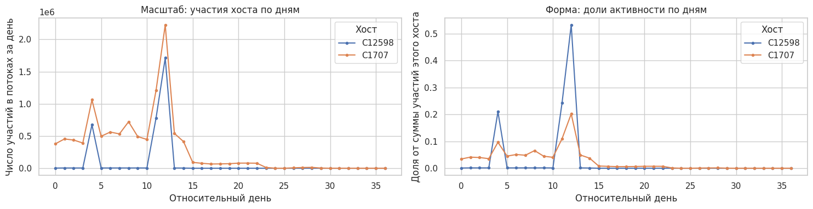
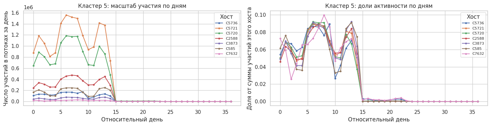
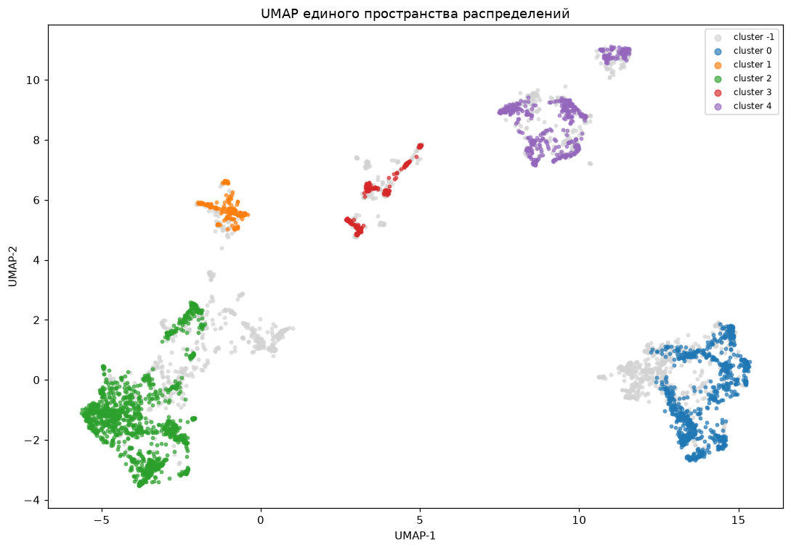
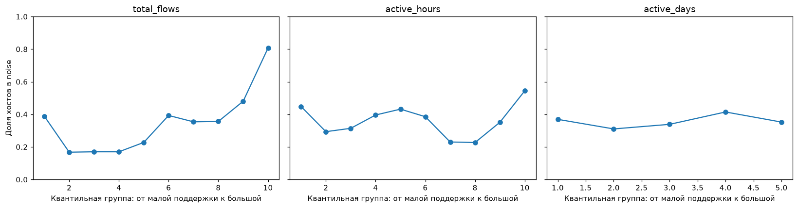
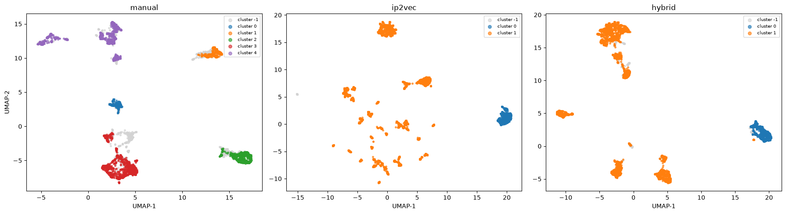
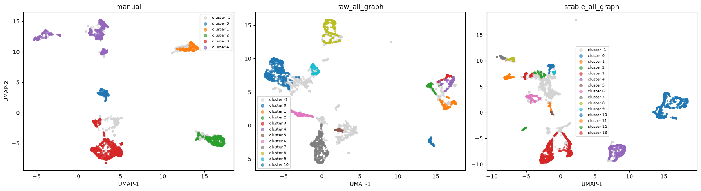
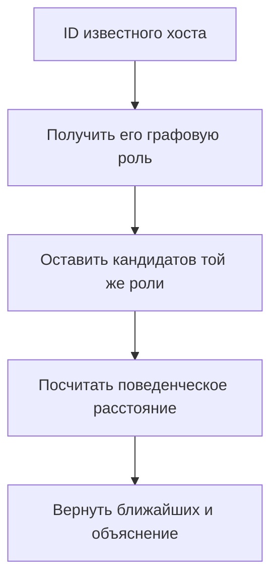
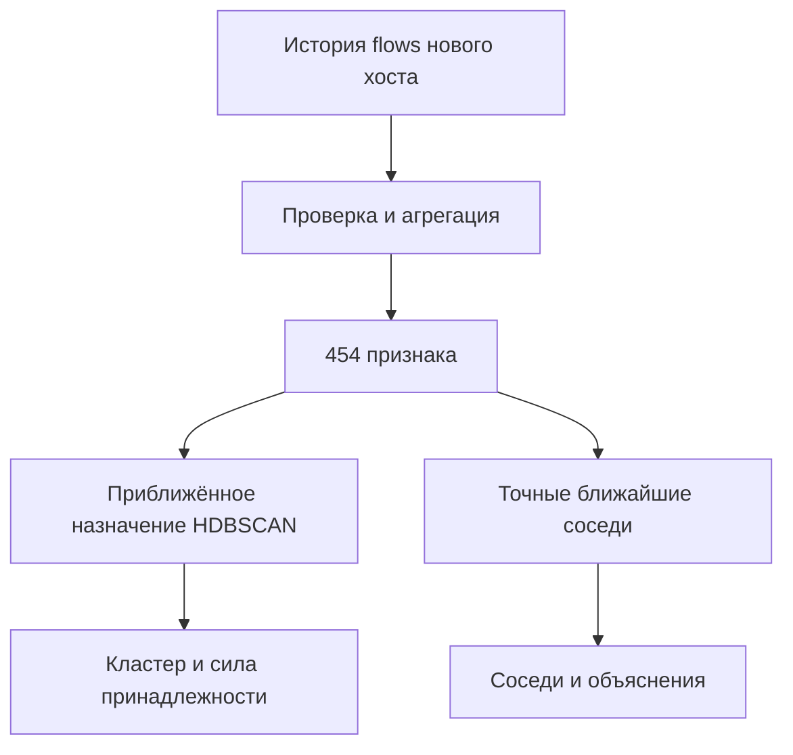

# Исследование сходства компьютеров по сетевым потокам LANL

Эта заметка описывает исследовательскую часть проекта: как из сетевых потоков
получено представление компьютера, какие гипотезы проверялись, почему часть из
них была отклонена и как интерпретировать итоговые метрики. Текст рассчитан на
читателя, который не видел код и не знаком с внутренней нумерацией
экспериментов.

Практическая инструкция по установке, HTTP API и проверке требований находится
в [README](../README.md).

## 1. Постановка задачи

Дан набор сетевых потоков корпоративной сети. Каждая запись описывает обмен
между двумя компьютерами и содержит:

- относительное время события;
- длительность соединения;
- компьютер-источник и компьютер-получатель;
- исходный и целевой порты;
- сетевой протокол;
- количество пакетов;
- количество байт.

Требуется без готовых меток ролей:

1. сгруппировать компьютеры по сетевому поведению;
2. найти для заданного компьютера наиболее похожие узлы;
3. объяснить найденное сходство;
4. проверить, насколько результат устойчив во времени;
5. применить модель к ранее неизвестному компьютеру через HTTP API.

Здесь нет эталонного столбца «сервер», «рабочая станция» или «компьютер
администратора». Поэтому найденные группы нельзя автоматически называть такими
ролями. Можно описывать наблюдаемые свойства групп, но предметное название
потребовало бы внешней разметки или экспертной проверки.

## 2. Главный вывод

Одного определения сходства недостаточно. Два компьютера могут:

- занимать похожее положение в структуре сети, но использовать разные сервисы;
- обращаться к похожим сервисам, но иметь разное число соседей и разную
  центральность;
- иметь одинаковый общий объём, но различаться направлением и временем работы.

Поэтому в итоговом решении разделены два уровня:

1. **структурная роль** — положение компьютера в графе устойчивых сетевых
   связей;
2. **поведенческий профиль** — время активности, сервисы, размеры потоков и
   соотношение входящего и исходящего трафика.

Для уже известного хоста структурная роль ограничивает множество кандидатов, а
поведенческое расстояние определяет порядок соседей. Для нового хоста, когда
полного нового графа сети нет, вычисляется только глобальный кластер и поиск по
полному вектору признаков. Такое ограничение лучше, чем выдавать непроверенную
эвристику за графовую роль.

## 3. Словарь используемых понятий

| Понятие | Простое объяснение |
|---|---|
| Сетевой поток | Агрегированная запись об одном сетевом взаимодействии |
| Хост | Один компьютер сети |
| Признак | Числовая характеристика поведения хоста |
| Вектор признаков | Все признаки одного хоста, записанные в фиксированном порядке |
| Кластеризация | Поиск групп без заранее известных правильных ответов |
| HDBSCAN | Алгоритм, находящий плотные группы и оставляющий неоднозначные объекты вне групп |
| Шум | Метка `-1`: алгоритм не нашёл достаточно плотного окружения |
| Граф | Компьютеры как вершины и связи между ними как рёбра |
| Графовая роль | Группа хостов с похожим положением в графе |
| Подтип | Дополнительная поведенческая группа внутри одной графовой роли |
| Ближайшие соседи | Хосты с наименьшим расстоянием до запроса |
| Проекция UMAP | Двумерная картинка многомерных данных только для визуальной диагностики |
| ARI | Мера согласия двух разбиений с поправкой на случайные совпадения |

## 4. Данные и выбор периода

Источник — network flow data из открытого набора Los Alamos National
Laboratory. Финальная модель строится на первых 15 сутках: от времени `1` до
`15 × 86 400` секунд включительно.

Первичный исследовательский анализ рассматривал более длинную временную ось. На
рисунке ниже два хоста имеют сходные пики абсолютного объёма, но разные доли
активности по дням. Это стало мотивацией не ограничиваться суммарным числом
соединений.



**Рисунок 1. Масштаб и форма активности — разные свойства.** Левая панель
показывает число участий в потоках, правая — долю каждого дня в активности
конкретного хоста. В итоговом обучении используется только период первых 15
суток, даже если исследовательский график показывает более длинную ось.

Внутри одной ранней группы хостов абсолютные объёмы заметно различались, тогда
как нормированные дневные профили были похожи.



**Рисунок 2. Нормирование помогает отделить форму поведения от масштаба.** Это
наблюдение привело к представлению распределений в долях и к отдельному учёту
интенсивности.

### 4.1 Как отбирались хосты

Обучающие признаки считаются по суткам `[0, 15)`. Для отбора устойчиво
наблюдаемых хостов используются полные дни с 1-го по 13-й и следующие условия:

- не менее 100 участий хоста в потоках;
- наблюдение хоста покрывает границы выбранного временного интервала;
- статистика изменения соседей определена минимум на двух переходах между
  соседними днями;
- для каждого реально активного направления имеется достаточно событий в
  воспроизводимой однопроцентной выборке;
- случайное зерно выборки фиксировано значением 42.

После фильтрации осталось 4 350 компьютеров. Фильтрация нужна не для улучшения
оценки задним числом, а чтобы не сравнивать полноценные 15-дневные профили с
хостами, появившимися на короткий промежуток.

### 4.2 Как один поток учитывается для двух хостов

Одна строка исходных данных создаёт два события участия:

- для источника — исходящее событие, сосед равен получателю;
- для получателя — входящее событие, сосед равен источнику.

Если источник и получатель совпали, строка учитывается в обоих направлениях.
Это правило одинаково применяется при обучении и при обработке нового хоста.

## 5. Построение признаков

Итоговый глобальный вектор содержит 454 координаты.

| Группа признаков | Размерность | Что измеряется |
|---|---:|---|
| Временная активность | 156 | Час суток, блоки дней, распределение часовой интенсивности |
| Используемые сервисы | 139 | Протоколы, локальные и удалённые порты |
| Размеры потоков | 76 | Распределения байт, пакетов и длительности |
| Направление | 1 | Баланс входящих и исходящих соединений |
| Взаимодействие с соседями | 82 | Распределение числа и интенсивности связей |
| **Всего** | **454** | |

Для локального поиска внутри графовой роли используется 372 координаты без
последней графовой группы. Это разделяет вопрос «где находится узел в сети» и
вопрос «как он ведёт себя внутри своей роли».

### 5.1 Время

Для числа flows, байт и пакетов строятся:

- профиль по 24 часам суток;
- профиль по двухдневным блокам;
- распределение часовой интенсивности по всем 360 часам периода.

К счётчикам добавляется небольшая доля глобального распределения обучающей
выборки. Коэффициент сглаживания равен 1:

$$
\hat p_i=\frac{c_i+\alpha p_i^{global}}{\sum_j c_j+\alpha},
\qquad \alpha=1.
$$

Для циклических профилей используется модуль дискретного преобразования Фурье.
Он описывает периодическую структуру, но теряет фазу: два одинаковых профиля,
сдвинутых по времени, могут оказаться близкими. Это осознанное ограничение
текущего представления.

### 5.2 Протоколы и порты

Протоколы, локальные порты и удалённые порты считаются отдельно. При построении
обучающего кэша сохраняются 64 наиболее частых порта. Остальные значения
объединяются:

- числовые и обычные строковые значения — в `OTHER`;
- именованные LANL-порты, начинающиеся с `N`, — в `N_OTHER`.

При обработке нового хоста словарь категорий не переобучается. Это гарантирует,
что размер и порядок вектора совпадут с обучающей моделью.

### 5.3 Размеры и длительности потоков

Байты, пакеты и длительность имеют длинные хвосты: редкие крупные значения могут
на порядки превышать типичные. Поэтому используются логарифмические интервалы:

$$
b(z)=\min\left(\left\lfloor\log_2(z+1)\right\rfloor,b_{max}\right).
$$

Верхние границы номера интервала:

- байты — 30;
- пакеты — 20;
- длительность — 20.

### 5.4 Направление трафика

Баланс направления вычисляется по числу потоков:

$$
direction=\frac{out-in}{out+in}.
$$

Значение около `1` соответствует преимущественно исходящему поведению, около
`-1` — входящему, около `0` — сбалансированному. В коде признак дополнительно
делится на `sqrt(2)` перед общей нормировкой.

### 5.5 Взаимодействие с соседями

Для каждой пары «хост — сосед» считаются число потоков, байты и пакеты. Затем
строятся распределения:

- числа потоков на одного соседа;
- байт на одного соседа;
- степени соседей, то есть числа их собственных связей.

Для нового хоста степень известного соседа берётся из обученной модели.
Неизвестный ранее сосед получает степень 0. Поэтому полностью новая часть сети
может быть представлена менее точно.

### 5.6 Преобразование распределений

После перевода счётчиков в доли применяется преобразование Хеллингера:

$$
h_i=\sqrt{p_i}, \qquad p_i=\frac{c_i}{\sum_j c_j}.
$$

Евклидово расстояние между такими векторами связано с расстоянием Хеллингера
между исходными распределениями. Для отсутствующей группы событий используется
отдельная координата `NO_MASS`, чтобы «нет данных» не смешивалось с обычным
распределением.

### 5.7 Балансировка групп признаков

В каждой группе может быть разное число логических блоков. Чтобы группа с
большим числом блоков не доминировала автоматически, её блоки масштабируются:

$$
w_f=\frac{1}{\sqrt{m_f}},
$$

где `m_f` — число блоков в группе. После объединения весь вектор хоста
нормируется до единичной длины.

До балансировки средний вклад групп в квадрат расстояния случайных пар был:

| Группа | Доля |
|---|---:|
| Время | 44,72% |
| Взаимодействие с соседями | 21,75% |
| Размеры потоков | 17,88% |
| Сервисы | 13,36% |
| Направление | 2,28% |

Это не доказывает, что после балансировки все группы одинаково полезны. Цель
преобразования скромнее: убрать преимущество, возникающее только из-за числа
координат.

## 6. Почему выбран HDBSCAN

Число естественных групп заранее неизвестно, а часть компьютеров действительно
может не быть похожа ни на одну большую группу. Поэтому был выбран HDBSCAN —
плотностной алгоритм, который:

- не требует заранее задавать число кластеров;
- допускает группы разной формы;
- возвращает метку `-1` для объектов вне плотных областей;
- даёт оценку силы принадлежности к найденной группе.

Это не означает, что HDBSCAN автоматически находит «истинные роли». Он только
выделяет плотные области в выбранном пространстве признаков. Результат зависит
от представления данных и параметров.

Параметры итоговых моделей:

| Модель | Минимальный размер кластера | Минимум соседей | Признаки |
|---|---:|---:|---|
| Глобальное поведение | 80 | 5 | 454 координаты |
| Графовая роль | 120 | 10 | 7 структурных координат |
| Подтип внутри роли | 30 | 8 | 372 поведенческие координаты |

Во всех случаях используется евклидова метрика и метод выбора кластеров EOM.

## 7. Последовательность гипотез и экспериментов

### 7.1 Гипотеза о едином вручную взвешенном пространстве

Первый подход объединял все свойства в один вектор с ручными весами. Проблема
состояла в том, что итог легко менялся при выборе коэффициентов, а большой блок
признаков мог доминировать лишь из-за размерности.

Решение: перейти от ручных коэффициентов отдельных координат к единообразным
преобразованиям распределений и балансировке логических групп.

### 7.2 Гипотеза об обязательном втором делении крупных групп

Проверялось жёсткое правило: каждый большой кластер обязательно разбивать ещё
раз. Оно дало:

- долю распределённых объектов `0.346857`;
- медианный ARI между временными окнами `0.177760`;
- минимальный ARI `0.110615`.

Такое деление создавало подтипы даже там, где данные не показывали устойчивой
внутренней структуры. Гипотеза была отклонена. В итоговой иерархии роль
делится только тогда, когда локальный HDBSCAN действительно находит не менее
двух плотных групп.

### 7.3 Визуальная проверка разделимости

Для двумерной визуализации использовался UMAP. Серые точки на рисунке — объекты
с меткой `-1`, цветные — найденные кластеры.



**Рисунок 3. Кластеры визуально различимы, но имеют пограничные области.** UMAP
не участвовал в обучении и может искажать расстояния, поэтому рисунок не
используется как самостоятельное доказательство качества.

### 7.4 Проверка природы объектов вне кластеров

Проверялась гипотеза, что метка `-1` возникает только у малоактивных хостов.



**Рисунок 4. Шум не сводится только к недостатку данных.** Доля объектов вне
кластеров меняется по числу потоков и активных часов, но присутствует в разных
группах активности. Поэтому метку `-1` нельзя автоматически трактовать как
«слишком мало наблюдений» или как «аномалию безопасности».

### 7.5 Исключение групп признаков по одной

Чтобы оценить влияние каждой группы, модель обучалась с теми же параметрами,
но без одного семейства признаков.

| Вариант | Число кластеров | Доля распределённых хостов | ARI с полной моделью |
|---|---:|---:|---:|
| Все группы | 5 | 0.731264 | 1.000000 |
| Без времени | 6 | 0.689885 | 0.709400 |
| Без направления | 4 | 0.732414 | 0.906869 |
| Без сервисов | 6 | 0.627126 | 0.653784 |
| Без размеров потоков | 6 | 0.703448 | 0.678893 |
| Без взаимодействий с соседями | 7 | 0.701839 | 0.608179 |

Наибольшие изменения разметки вызвало исключение признаков соседей и сервисов.
Направление влияло слабее, но его удаление всё равно меняло число кластеров.
Поэтому все пять групп были сохранены.

ARI показывает изменение разбиения, но сам по себе не говорит, какая из двух
моделей лучше. Абляция подтверждает полезность группы только вместе с анализом
качества и смысла результата.

### 7.6 Проверка устойчивости во времени

Модели отдельно обучались на трёх пятидневных окнах и сравнивались с моделью
полного периода.

| Период | Кластеры | Доля распределённых | ARI с полной моделью | Совпадение соседей среди 10 ближайших |
|---|---:|---:|---:|---:|
| Дни 0–5 | 11 | 0.572020 | 0.326776 | 0.208260 |
| Дни 5–10 | 9 | 0.692042 | 0.638931 | 0.315110 |
| Дни 10–15 | 11 | 0.564934 | 0.268450 | 0.214735 |

Среднее окно согласуется с полной моделью лучше раннего и позднего, но общей
высокой стабильности нет. Это признак временного дрейфа, а не основание объявить
одну разметку неизменной характеристикой сети.

Дополнительная проверка показала сильное изменение доступной популяции: 4 349
хостов в раннем окне, 526 в среднем и 68 в позднем. Совпадение десяти ближайших
соседей составляло `0.416920` и `0.463235` для среднего и позднего окон среди
сравнимых узлов. Поэтому объединять все периоды и считать их независимыми
повторами одной популяции было бы некорректно.

### 7.7 Гипотеза о векторном представлении графа

Проверялось экспериментальное представление графа, обозначенное IP2Vec, и его
объединение с ручными поведенческими признаками.

| Сравниваемые пространства | ARI | Совпадение 10 ближайших соседей |
|---|---:|---:|
| Ручные признаки и IP2Vec | 0.140061 | 0.042782 |
| Ручные признаки и объединённый вариант | 0.152208 | 0.423103 |
| IP2Vec и объединённый вариант | 0.900053 | 0.197448 |

Объединённый вариант почти повторял IP2Vec и дал две резко несбалансированные
группы: 760 и 3 405 объектов, ещё 185 объектов получили метку `-1`. Это
означает, что графовое представление подавляло ручные поведенческие сигналы и
ухудшало объяснимость.



**Рисунок 5. Объединённый вариант наследует структуру IP2Vec.** Поэтому
автоматическое графовое представление не вошло в итоговую модель.

### 7.8 Гипотеза об устойчивом графе связей

Сырой граф содержит множество единичных и кратковременных контактов. Была
проверена идея оставить только направленные связи, встречавшиеся минимум в трёх
разных днях.

| Характеристика | Сырой граф | Граф устойчивых связей |
|---|---:|---:|
| Число рёбер | 158 074 | 98 993 |
| Сохранённая доля flows | — | 93,19% |
| Сохранённая доля байт | — | 94,45% |
| Сохранённая доля пакетов | — | 94,73% |

Было удалено около 37% рёбер, но сохранилось более 93% каждого объёмного
показателя. Это поддерживает интерпретацию удалённых рёбер как редких контактов,
а не основной коммуникационной структуры.

Для каждого хоста на устойчивом графе рассчитываются семь характеристик:

1. PageRank в направленном графе — центральность с учётом направления;
2. PageRank в ненаправленном графе;
3. взаимность — доля соседей, с которыми связь наблюдается в обе стороны;
4. номер ядра — принадлежность к плотно связанной части графа;
5. коэффициент кластеризации — насколько соседи связаны между собой;
6. средняя степень соседей;
7. число достижимых соседей на расстоянии не более двух рёбер.

Перед кластеризацией каждая характеристика центрируется по медиане, делится на
межквартильный размах и ограничивается диапазоном `[-8, 8]`.



**Рисунок 6. Разные определения графа дают разную структуру групп.** Некоторые
варианты имели высокий внутренний показатель, но фактически создавали один
доминирующий кластер. Итоговый вариант выбирался по совокупности разделимости,
доли распределённых объектов, баланса размеров и интерпретируемости, а не по
максимуму одной метрики.

### 7.9 Иерархия ролей и подтипов

После определения графовых ролей внутри каждой роли запускалась отдельная
поведенческая модель. Если она находила меньше двух групп, роль оставалась
единой. Разделились только роли 5, 6 и 7.

| Графовая роль | Решение | Размеры подтипов | Хосты вне подтипов | Силуэт |
|---:|---|---|---:|---:|
| 0 | оставить единой | 182 | 0 | — |
| 1 | оставить единой | 163 | 0 | — |
| 2 | оставить единой | 161 | 0 | — |
| 3 | оставить единой | 155 | 0 | — |
| 4 | оставить единой | 430 | 0 | — |
| 5 | разделить | 1 150, 206 | 220 | 0.382714 |
| 6 | разделить | 176, 77, 55 | 149 | 0.198033 |
| 7 | разделить | 71, 63 | 147 | 0.311874 |

Для роли 7 локальная модель распределила по подтипам только 47,69% объектов.
Поэтому локальные подтипы следует считать вспомогательным аналитическим
сигналом, а не обязательной категорией каждого компьютера.

Составная метка читается так:

- `G6.B1` — графовая роль 6, поведенческий подтип 1;
- `G6.noise` — роль 6 известна, но плотный подтип не найден;
- `graph_noise` — не найдена даже плотная графовая роль.

## 8. Итоговые результаты

### 8.1 Глобальные поведенческие кластеры

| Показатель | Значение |
|---|---:|
| Хосты | 4 350 |
| Размерность | 454 |
| Кластеры | 5 |
| Размеры кластеров | 1 271, 965, 537, 317, 241 |
| Хосты вне кластеров | 1 019, или 23,43% |
| Доля распределённых хостов | 76,57% |
| Коэффициент силуэта | 0.243980 |
| Внутренняя относительная оценка HDBSCAN | 0.042611 |

Интерпретация: модель нашла несколько различимых плотных областей, но границы
глобального поведения не являются резкими. Низкая внутренняя относительная
оценка не позволяет утверждать, что это единственно правильное естественное
разбиение сети.

### 8.2 Графовые роли

| Показатель | Значение |
|---|---:|
| Хосты | 4 350 |
| Размерность | 7 |
| Роли | 8 |
| Размеры ролей | 1 576, 457, 430, 281, 182, 163, 161, 155 |
| Хосты вне ролей | 945, или 21,72% |
| Доля распределённых хостов | 78,28% |
| Коэффициент силуэта | 0.370176 |
| Внутренняя относительная оценка HDBSCAN | 0.447839 |

Графовое пространство разделяется убедительнее поведенческого. Однако номера
ролей всё ещё не являются названиями реальных функций компьютеров. Для
содержательной маркировки нужно изучить медианные профили ролей из
`artifacts/similarity_model.json` и подтвердить выводы дополнительными
источниками.

## 9. Как работает поиск похожих хостов

### 9.1 Известный хост



Если явно передан параметр `within_graph_role=false`, шаг фильтрации пропускается
и поиск идёт среди всех известных хостов. Такой режим полезен как контроль, но
не является основным.

Расстояние между двумя поведенческими векторами:

$$
d(x,y)=\sqrt{\sum_j(x_j-y_j)^2}.
$$

Отображаемый балл сходства:

$$
similarity\_score=\exp(-d).
$$

Это монотонное преобразование: меньшая дистанция даёт больший балл. Оно не
обучалось на метках и не является вероятностью одинаковой роли.

### 9.2 Объяснение расстояния

Для каждой группы признаков рассчитываются собственная дистанция и доля в
квадрате полного расстояния:

$$
d_f=\sqrt{\sum_{j\in f}(x_j-y_j)^2},
\qquad
share_f=\frac{d_f^2}{d^2}.
$$

Если полное расстояние не равно нулю, суммы `share_f` дают 1 с учётом
погрешности вычислений. Большая доля сервисов означает не «плохое сходство
сервисов» вообще, а то, что именно сервисы объясняют большую часть различия
данной пары.

### 9.3 Новый хост



Применяется `approximate_predict` обученной HDBSCAN-модели. Слово
«приближённое» относится к назначению новой точки в уже зафиксированную
плотностную модель; сама модель не переобучается. Поиск соседей выполняется
точно через `NearestNeighbors`, а не через приближённый индекс.

Новый хост не получает графовую роль и локальный подтип. Чтобы корректно
пересчитать PageRank, номер ядра, коэффициент кластеризации и соседей второго
порядка, нужен полный граф новой сети, а не только список потоков одного узла.

## 10. Как считаются метрики

### 10.1 Доля распределённых объектов

В коде поле называется `coverage`:

$$
coverage=\frac{|\{i:y_i\ne-1\}|}{n}.
$$

Высокое значение означает, что мало объектов осталось вне кластеров. Само по
себе оно не гарантирует хорошее разделение: один огромный кластер тоже дал бы
высокую долю.

### 10.2 Коэффициент силуэта

Для объекта `i`:

$$
s(i)=\frac{b(i)-a(i)}{\max(a(i),b(i))},
$$

где `a(i)` — средняя дистанция до объектов собственного кластера, а `b(i)` —
минимальная средняя дистанция до другого кластера. Значение ближе к 1 означает
хорошее отделение; около 0 — пересечение групп; отрицательное — возможное
неверное назначение.

В отчёте силуэт считается только для объектов с меткой не `-1`. Если таких
объектов больше 1 500, используется воспроизводимая случайная подвыборка из
1 500 элементов.

### 10.3 Внутренняя относительная оценка HDBSCAN

В коде используется атрибут `HDBSCAN.relative_validity_`. В ранних рабочих
материалах его ошибочно называли DBCV. Это неточное название исправлено:
проект не выдаёт значение за отдельно рассчитанный полный DBCV.

Оценка полезна для сравнения близких конфигураций, но её нельзя рассматривать
как абсолютную гарантию правильности кластеров.

### 10.4 Скорректированный индекс Рэнда

Adjusted Rand Index, или ARI, сравнивает пары объектов в двух кластеризациях и
корректирует случайное совпадение. Значение 1 означает одинаковое разбиение с
точностью до перенумерации кластеров, около 0 — совпадение на уровне случайного.

### 10.5 Совпадение ближайших соседей

Для хоста сравниваются множества из `k` ближайших соседей в двух моделях:

$$
overlap@k=\frac{|N_k^A(i)\cap N_k^B(i)|}{k}.
$$

Метрика дополняет ARI: даже при изменении глобальных кластеров локальное
окружение хоста может остаться похожим.

## 11. Какие гипотезы не подтвердились

| Гипотеза | Что показали данные | Решение |
|---|---|---|
| Все крупные группы нужно обязательно дробить | Подтипы получались нестабильными во времени | Делить только роли, где найдено не менее двух плотных групп |
| Достаточно выбрать вариант с максимальной внутренней метрикой | Некоторые варианты создавали один доминирующий кластер | Учитывать также размеры, долю шума, устойчивость и объяснимость |
| IP2Vec улучшит ручные признаки | Объединённый вариант почти полностью повторял IP2Vec | Не включать IP2Vec в финальную модель |
| Метка `-1` означает только малое число наблюдений | Шум встречался в разных группах активности | Не трактовать `-1` как недостаток данных или атаку без дополнительной проверки |
| Временные окна дадут одну и ту же структуру | ARI и совпадение соседей заметно менялись | Зафиксировать временной дрейф как ограничение |
| По истории одного нового хоста можно определить его графовую роль | Структурные метрики зависят от полного графа | Возвращать `null`, а не неподтверждённую оценку |

## 12. Воспроизводимость

Обучение запускается одной командой:

```powershell
python -m nad_similarity.training --flows data/raw/flows.txt.gz
```

Сценарий:

1. проверяет входные данные;
2. строит или повторно использует DuckDB-кэш;
3. требует получить ровно 4 350 отобранных хостов;
4. обучает глобальную и графовую модели;
5. строит локальные подтипы;
6. сверяет размеры групп и метрики с контрольным запуском;
7. атомарно сохраняет pickle и JSON-отчёт;
8. записывает SHA-256 контрольную сумму артефакта.

Контрольные результаты хранятся в `src/nad_similarity/training.py`. Если
структура кластеров изменилась, обучение завершается ошибкой, а не молча
перезаписывает эталон.

Карта исследовательских решений и кода:

| Решение | Реализация |
|---|---|
| Отбор и агрегация | `aggregation.py` |
| Преобразование распределений | `features.py` |
| Глобальная кластеризация и соседи | `model.py` |
| Граф устойчивых связей | `graph.py` |
| Локальные подтипы | `hierarchy.py` |
| Новый хост | `inference.py` |
| Объяснение расстояний | `service.py` |
| Контроль результатов | `training.py` |

## 13. Ограничения и дальнейшая работа

### Ограничения текущей работы

- Исследован один набор данных и один 15-дневный период.
- Временная устойчивость умеренная; поведение сети меняется между окнами.
- У групп нет подтверждённых функциональных названий.
- Коэффициент силуэта глобальной модели умеренный, а её относительная оценка
  HDBSCAN низкая.
- Модуль преобразования Фурье не сохраняет фазу временного профиля.
- Плотностная кластеризация оставляет значительную часть хостов вне групп.
- Для нового узла результат зависит от полноты переданной истории.
- Новый узел не получает графовую роль без полного снимка сети.
- SQL-хранилище запросов и аналитический веб-интерфейс не реализованы.

### Обоснованные следующие шаги

1. Получить внешнюю разметку или экспертные описания части хостов и проверить
   семантику найденных ролей.
2. Сравнить временные признаки с представлением, сохраняющим фазу, например с
   синусными и косинусными коэффициентами вместо одного модуля спектра.
3. Оценить модель на скользящих временных окнах с сопоставимой популяцией
   хостов.
4. Добавить контроль дрейфа распределений и качества соседей.
5. Реализовать пакетное обновление полного графа для новых хостов.
6. Добавить SQL-журнал запросов только после определения требований к
   приватности, сроку хранения и объёму данных.
7. Создать веб-интерфейс, показывающий профиль запроса, соседей и вклад групп
   признаков, а не только двумерную проекцию.

## 14. Проверка отображения изображений

Все шесть рисунков находятся в каталоге `docs/figures`, а ссылки в этом файле
заданы относительно `docs/research-notes.md` через `./figures/...`.

Перед отправкой репозитория можно проверить их наличие:

```powershell
$expected = @(
    "eda_host_daily_activity.png",
    "eda_cluster_daily_activity.png",
    "v14_umap.png",
    "v14_noise_support.png",
    "v18_space_comparison.png",
    "v19_graph_spaces.png"
)

$expected | ForEach-Object {
    Test-Path (Join-Path ".\docs\figures" $_)
}

git ls-files docs/figures
```

Все вызовы `Test-Path` должны вернуть `True`, а `git ls-files` — вывести шесть
файлов. Если изображения открываются локально, но не видны на GitHub, чаще
всего они не были добавлены в коммит.

## Приложение Внутренние номера экспериментов

Номера использовались только как рабочая хронология. Они не являются версиями
алгоритмов HDBSCAN или общепринятыми терминами.

| Внутреннее обозначение | Что проверялось |
|---|---|
| v14 | Единое пространство распределений и визуальная диагностика |
| v15 | Балансировка групп признаков и исключение групп по одной |
| v17 | Проверка временной устойчивости |
| v18 | IP2Vec и объединённое пространство |
| v19 | Граф устойчивых связей и графовые роли |
| v20 | Поведенческие подтипы внутри графовых ролей |

Идентификатор артефакта `v2_v20_hierarchical` означает второй формат
сохраняемого объекта, включающий иерархическую модель из последнего этапа. Этот
идентификатор нужен коду для проверки совместимости, но не должен использоваться
как объяснение метода.
